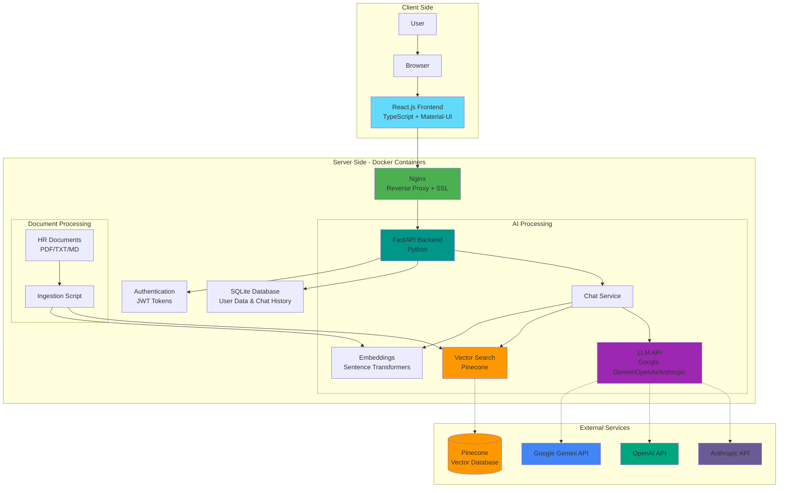

# HR Bot Prototype

An AI-powered HR assistant bot that provides instant answers to common HR questions using advanced language models and document retrieval.

## Architecture



## Features

- 🤖 AI-powered responses using Google Gemini/OpenAI/Anthropic
- 📚 Vector search with Pinecone for document retrieval
- 🎯 React.js frontend with TypeScript
- ⚡ FastAPI backend with Python
- 📝 Document ingestion and RAG capabilities
- 🔐 Authentication and session management
- 🐳 Docker support
- 🔄 CI/CD with GitHub Actions

## Quick Start

### Prerequisites

- Docker and Docker Compose
- Node.js 18+ (for local development)
- Python 3.11+ (for local development)
- Git
- Pinecone API key (free tier)
- Google Gemini API key (recommended - free tier) or OpenAI/Anthropic API key

### Local Development Setup

1. Clone the repository:
```bash
git clone <your-repo-url>
cd hr-bot-prototype
```

2. Set up environment variables:
```bash
cp backend/.env.example backend/.env
# Edit .env with your API keys
```

3. Start the application:
```bash
docker-compose up -d
```

4. Access the application:
- Frontend: http://localhost
- Backend API: http://localhost:8000
- API Documentation: http://localhost:8000/docs

### Docker Deployment

The application is containerized using Docker and can be deployed using Docker Compose:

```bash
# Build and start all services
docker-compose up -d

# View logs
docker-compose logs -f

# Stop all services
docker-compose down
```

## System Components

### 1. Frontend (React + TypeScript)
- Modern UI with responsive design
- Real-time chat interface
- Authentication and session management
- Error handling and loading states
- Material-UI components
- TypeScript for type safety

### 2. Backend (FastAPI + Python)
- RESTful API endpoints
- Authentication and authorization
- Document processing and vector search
- AI model integration
- Database management
- Rate limiting and security features

### 3. Nginx
- Reverse proxy
- Static file serving
- SSL/TLS termination
- Load balancing
- Rate limiting
- Security headers

### 4. AI Processing Pipeline
- Document ingestion and chunking
- Vector embeddings generation
- Semantic search using Pinecone
- LLM integration (Gemini/OpenAI/Anthropic)
- Context-aware response generation

## API Endpoints

### Authentication
- `POST /api/auth/login` - User authentication
- `POST /api/auth/refresh` - Refresh access token

### Chat
- `POST /api/chat` - Send message to HR bot
- `GET /api/conversations` - Get conversation history
- `DELETE /api/conversations/{id}` - Delete conversation

### System
- `GET /health` - Health check
- `GET /docs` - API documentation (Swagger UI)
- `GET /redoc` - API documentation (ReDoc)

## Security Features

- JWT-based authentication
- Environment variable management
- CORS configuration
- Rate limiting:
  - Login: 5 requests per 15 minutes
  - Chat API: 30 requests per minute
  - General API: 100 requests per minute
- Input validation
- Secure password handling
- Security headers
- SSL/TLS support

## Project Structure

```
hr-bot-prototype/
├── backend/
│   ├── app/
│   │   ├── auth.py              # Authentication logic
│   │   ├── chat_service.py      # Chat and vector search
│   │   ├── config.py            # Configuration
│   │   ├── database.py          # Database setup
│   │   ├── main.py              # FastAPI application
│   │   └── models.py            # Database models
│   ├── scripts/
│   │   └── ingest_docs.py       # Document ingestion
│   ├── tests/                   # Backend tests
│   ├── .env.example            # Environment template
│   ├── Dockerfile              # Backend container
│   └── requirements.txt        # Python dependencies
├── frontend/
│   ├── public/                 # Static files
│   ├── src/
│   │   ├── components/         # React components
│   │   ├── services/           # API services
│   │   └── App.tsx            # Main component
│   ├── Dockerfile             # Frontend container
│   └── package.json           # Node dependencies
├── nginx/
│   └── nginx.conf             # Nginx configuration
├── hr-documents/              # HR documentation
├── docker-compose.yml         # Docker services
└── README.md                 # Documentation
```

## Configuration

### Environment Variables

Create a `.env` file in the backend directory with the following variables:

```env
# Database
DATABASE_URL=sqlite:///./data/database/hrbot.db

# Authentication
SECRET_KEY=your-secret-key
ALGORITHM=HS256
ACCESS_TOKEN_EXPIRE_MINUTES=30

# AI Model
AI_MODEL=gemini  # or openai
OPENAI_API_KEY=your-openai-api-key
GOOGLE_API_KEY=your-google-api-key

# Vector Store
PINECONE_API_KEY=your-pinecone-api-key
PINECONE_ENVIRONMENT=your-pinecone-environment
PINECONE_INDEX=your-pinecone-index

# Application
HR_DOCS_PATH=./data/hr_docs
DEBUG=False
```

## Development

### Backend Development

1. Create a virtual environment:
```bash
python -m venv venv
source venv/bin/activate  # or `venv\Scripts\activate` on Windows
```

2. Install dependencies:
```bash
pip install -r backend/requirements.txt
```

3. Run the development server:
```bash
uvicorn app.main:app --reload
```

### Frontend Development

1. Install dependencies:
```bash
cd frontend
npm install
```

2. Start the development server:
```bash
npm start
```

## Contributing

1. Fork the repository
2. Create a feature branch
3. Commit your changes
4. Push to the branch
5. Create a Pull Request

## License

This project is licensed under the MIT License - see the LICENSE file for details. 